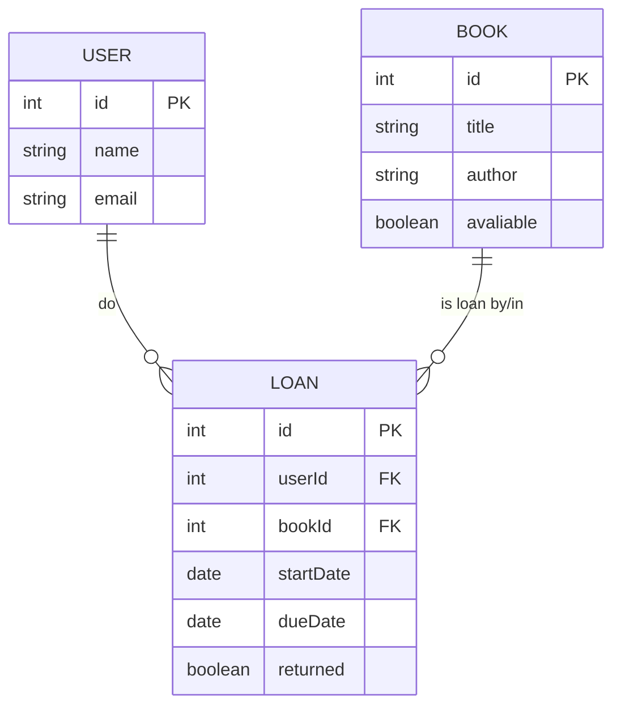

# Projeto Biblioteca API JSON

## 1. Identificação do Projeto

- **Nome do Projeto**: Biblioteca App
- **Descrição**: Aplicativo móvel multiplataforma (Flutter) para gerenciamento de bibliotecas, com funcionalidades de CRUD ( Criar , Ler, Atualizar, Deletar) para Usuários, Livros e Empréstimos.

## 2. Propósito e Escopo

O Sistema tem como Objetivo digitalizar e simplificar a gestão de acervos bibliotecários. Ele permite o cadastro e controle de livros, usuários e empréstimos, oferencedo uma interface intuitiva para administradores.

O Escopo atual inclui operaçoes básica de gerenciamento de dados persistidos em um backend simulado via json-server.

## 3. Requisitos do Sistema

### 3.1 Requisitos Funcionais (RF)

| ID | Requisito | Descrição |
| - | - | - |
| RF01 | Gerenciar Livros | Listar, Cadastrar, Editar e Excluir livros do acervo |
| RF02 | Gerenciar Usuários | Listar, Cadastrar, Editar e Excluir Usuários do Sistema |
| RF03 | Gerenciar Empréstimos de Livros | Visualizar e gernciar empréstimos de livros |
| RF04 | Navegação | Interface com Navegação por abas ( Livros, Empréstimos, Usuários) |

### 3.2 Requisitos Não Funcionais (RNF)

| ID | Requisito | Descrição |
| - | - | - |
| RNF01 | Arquitetura | Baseada em Camadas ( Model, Service, Controller, View) seguindo o padrão MVC |
| RNF02 | Persistência | Utiliza um arquivo db.json como fonte de dados acessando via APIREST (json-server) |
| RNF03 | Tecnologia | Desenvolvimento em Flutter/Dart, com consumo de Api via pacote http |
| RNF04 | Comuicação | A comunicação com o BackEnd é feita através de requisições HTTP sincronas (GET, POST, PUT, DELETE) |

## 4. EndPoint da API (BackEnd)

| Método | EndPoint | Descrição |
| - | - | - |
| GET | /users | Listar todos os usuários |
| GET | /users/{id} | Busca um usuário pelo ID |
| POST | /users | Criar um novo Usuário |
| PUT | /users/{id} | Atualiza um usuário |
| DELETE | /users/{id} | Remove o usuário |
| GET | /books | Listar todos os livros |
| GET | /books/{id} | Busca um livro pelo ID |
| POST | /books | Criar um novo livro |
| PUT | /books/{id} | Atualiza um livro |
| DELETE | /books/{id} | Remove o livro |
| GET | /loans | Listar todos os empréstimos |
| GET | /loans/{id} | Listar um empréstimo pelo ID |
| POST | /loans | Registrar um novo Empréstimo |

## 5. Diagramas

### 5.1 Diagrama de Entidades Relacionais (DER)



### 5.2 Diagramas de Classe

```mermaid

classDiagram

    class UserModel{
        -String? id
        -String name
        -String email
        +toMap() Map
        +fromMap(Map map) UserModel
    }
    
    class BookModel {
        -String? id
        -String title
        -String author
        -bool avaliable
        +toMap() Map
        +fromMap(Map map) BokkModel
    }

    class LoanModel {
        -String? id
        -UserModel user
        -BookModel book
        -DateTime startDate
        -DateTime dueDate
        -bool returned
        +toMap() Map
        +fromMap(Map map) LoanModel
    }

    class ApiService{
        <<static>>
        -String _baseUrl
        +getList(String path) Future<List>
        +getOne(String path , String id) Future<Map>
        +post(String path, Map Body) Future<Map>
        +put(String path, Map body, String id) Future<Map>
        +delete<String path, String id> void
    }

    class UserController{CRUD}

    class BookController{CRUD}

    class LaonController{CRUD}